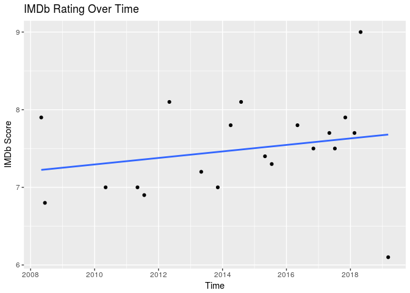
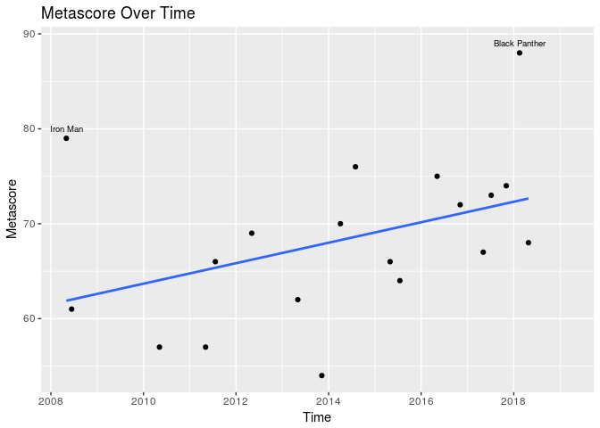
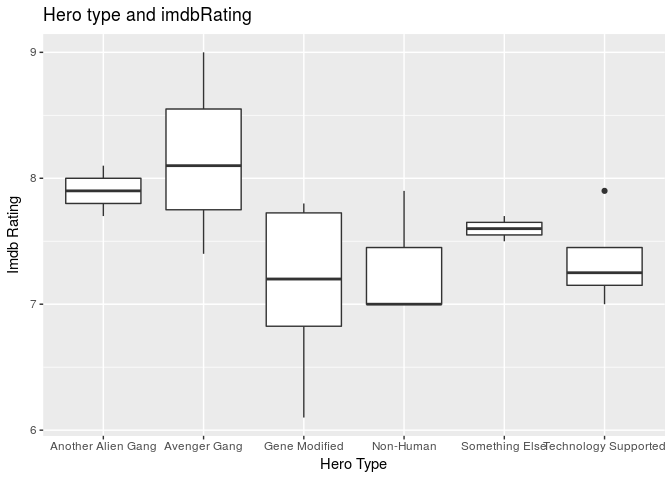
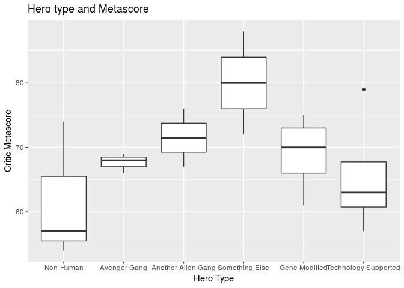
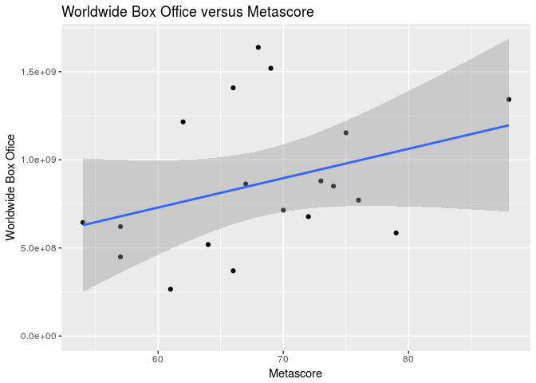
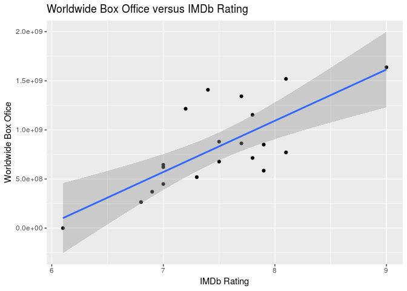
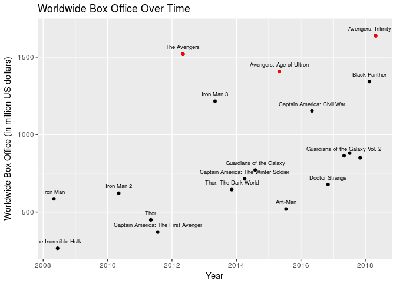
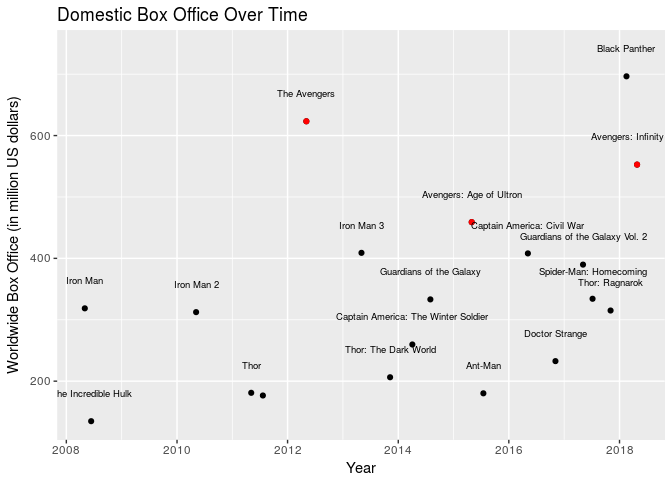
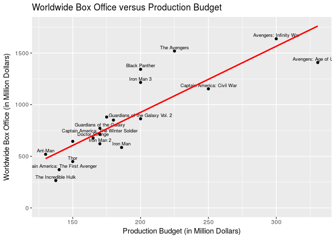

Data Set Acquisition
====================

1. Gross Data Set
-----------------

The information about gross was scraped from [The Number
website](https://www.the-numbers.com/movies/franchise/Marvel-Cinematic-Universe#tab=summary).

The information about the movies was collected from API Keys.

    marvellist <- c("Iron+Man","The+Incredible+Hulk", "Iron+Man+2", "Thor", "Captain+America:+The+First+Avenger", "The+Avengers", "Iron+Man+3", "Thor:+The+Dark+World", "Captain+America:+The+Winter+Soldier", "Guardians+of+the+Galaxy", "Avengers:+Age+of+Ultron", "Ant-Man", "Captain+America:+Civil+War", "Doctor+Strange", "Guardians+of+the+Galaxy+Vol+2", "Spider-Man%3A+Homecoming", "Thor%3A+Ragnarok", "Black+Panther", "Avengers%3A+Infinity+War", "Ant-Man+and+the+Wasp", "Captain+Marvel")

    heroes <- c("Technology Supported", "Gene Modified", "Technology Supported", "Non-Human", "Gene Modified", "Avenger Gang", "Technology Supported", "Non-Human", "Gene Modified", "Another Alien Gang", "Avenger Gang", "Technology Supported", "Gene Modified", "Something Else", "Another Alien Gang", "Gene Modified", "Non-Human", "Something Else", "Avenger Gang", "Technology Supported", "Gene Modified" )

    myapikey <- "a1791103"

    # Set up empty tibble
    imdb_table <- tibble(Title = character(), Direction = character(), Runtime = character(),
           Actors = character(), Metascore = double(), imdbRating = double(),
           BoxOffice = double(), Awards = character(), ReleaseDate = date(), HeroType = character())

    # Use for loop to run through API request process 5 times,
    #   each time filling the next row in the tibble
    for(i in 1:21) {
      url <- str_c("http://www.omdbapi.com/?t=",marvellist[i],
                   "&plot=short&r=json&apikey=", myapikey)
      onemovie <- GET(url)
      details <- content(onemovie, "parse")
      imdb_table[i,1] <- details$Title
      imdb_table[i,2] <- details$Director
      imdb_table[i,3] <- details$Runtime
      imdb_table[i,4] <- details$Actors
      imdb_table[i,5] <- parse_number(details$Metascore)
      imdb_table[i,6] <- parse_number(details$imdbRating)
      imdb_table[i,7] <- parse_number(details$BoxOffice)
      imdb_table[i,8] <- details$Awards
      imdb_table[i,9] <- release_date[i]
      imdb_table[i,10]<- heroes[i]
    }

    marvel_movies <- as_tibble(imdb_table) %>%
        mutate(ReleaseDate = fct_recode(ReleaseDate, "July 17, 2015 (2015-07-17)" ="July 17, 2015"),
      ReleaseDate = str_extract(ReleaseDate, "....-..-..")) %>%
      left_join(gross, c("Title" = "Movie")) %>%
      as_tibble()

    show(marvel_movies)

    ## # A tibble: 21 x 14
    ##    Title  Direction  Runtime Actors  Metascore imdbRating BoxOffice Awards
    ##    <chr>  <chr>      <chr>   <chr>       <dbl>      <dbl>     <dbl> <chr> 
    ##  1 Iron … Jon Favre… 126 min Robert…      79.0       7.90 318298180 Nomin…
    ##  2 The I… Louis Let… 112 min Edward…      61.0       6.80 134518390 1 win…
    ##  3 Iron … Jon Favre… 124 min Robert…      57.0       7.00 312057433 Nomin…
    ##  4 Thor   Kenneth B… 115 min Chris …      57.0       7.00 181015141 5 win…
    ##  5 Capta… Joe Johns… 124 min Chris …      66.0       6.90 176636816 3 win…
    ##  6 The A… Joss Whed… 143 min Robert…      69.0       8.10 623279547 Nomin…
    ##  7 Iron … Shane Bla… 130 min Robert…      62.0       7.20 408992272 Nomin…
    ##  8 Thor:… Alan Tayl… 112 min Chris …      54.0       7.00 206360018 3 win…
    ##  9 Capta… Anthony R… 136 min Chris …      70.0       7.80 228636083 Nomin…
    ## 10 Guard… James Gunn 121 min Chris …      76.0       8.10 270592504 Nomin…
    ## # ... with 11 more rows, and 6 more variables: ReleaseDate <chr>,
    ## #   HeroType <chr>, ProductionBudget <chr>, DomesticOpeningWeekend <chr>,
    ## #   `DomesticBox Office` <chr>, `WorldwideBox Office` <chr>

------------------------------------------------------------------------

Data set **marvel\_movies** \*\*\*

Data Visualisation
==================

1 Rating of Movie over time
===========================

Both IMDb rating and Metascore seems to be increasing over time.
However, IMDb rating is increasing more rapidly than Metascore. This may
mean that producers are making more movies that better appeal to
audience over time and more audience are attracted to the sequence. Take
for example the movie Black Panther. Not only is it under one of the top
rating Hero Type movie categories ("Something else"), it is was also
dubbed as revolutionary with its black superhero in a time in our
history that race and representation disccussions are so prominent.

    ggplot(data = marvel_movies, mapping = aes(x = as.Date(ReleaseDate), y= imdbRating)) +
      geom_point(na.rm = TRUE) +
        geom_smooth(se = FALSE, method = "lm") +
      labs(title = "IMDb Rating Over Time", y = "IMDb Score", x = "Time")

    ## Warning: Removed 1 rows containing non-finite values (stat_smooth).

    ggplot(data = marvel_movies, mapping = aes(x = as.Date(ReleaseDate), y= Metascore)) +
      geom_point(na.rm = TRUE) +
      geom_text(data = dplyr::filter(marvel_movies, Metascore >78), mapping = aes(label = Title), size = 2.5, nudge_y = 1) +
        geom_smooth(se = FALSE, method = "lm", na.rm = TRUE) +
      labs(title = "Metascore Over Time", y = "Metascore", x = "Time")

We deduced the rating scores would correlate to the popularity of the
movies. The graph demonstrates that MCU movies increase in popularity
over time.

2 Hero type and rating (Metascore & imdbRating)
===============================================

The hero type "Something Else" (which consists of Black Panther and Dr.
Strange) has the the highest Metascore while "Avenger Gang" has the
highest imdb rating. Metascores are given by critics and weighted
according to the fame of the critic while imdb rating are more audience
rating. While the critic ratings can influence whether or not people
watch the movie, we may also be able to say that there is no significant
difference between IMDb Rating and Metascore because both "Something
Else" and "Avenger Gang" are part of the top three hero type in both
types of ratings. We assumed that the audience would prefer movies with
all superheroes starring in one movie than movies where only one hero is
the main character.

    # imdbRating
    ggplot(data = marvel_movies, mapping = aes(x = HeroType, y = imdbRating)) + 
      geom_boxplot() + 
      labs(title = "Hero type and imdbRating", x = "Hero Type", y = "Imdb Rating")

    ## Warning: Removed 1 rows containing non-finite values (stat_boxplot).

    # Metascore 
    ggplot(marvel_movies, aes(x = reorder(HeroType, Metascore, FUN = median), y = Metascore)) + geom_boxplot() +
      labs(title = "Hero type and Metascore", x = "Hero Type", y = "Critic Metascore")

    ## Warning: Removed 2 rows containing non-finite values (stat_boxplot).

3 WorldwideBox Office vs. Ratings
=================================

There is not clear relationship between worldwide box office and and
metascore, but there is a relationship between worldwide box office and
IMDb Rating. This shows that the opinion from the audience plays a more
important role in the the outcome of the movies.

    ggplot(data = marvel_movies, mapping = aes(x = Metascore, y = parse_number(`WorldwideBox Office`))) +
      geom_point(na.rm = TRUE) +
      geom_smooth(method = "lm", na.rm = TRUE) +
      labs(y = "Worldwide Box Ofice", title = "Worldwide Box Office versus Metascore")

    ggplot(data = marvel_movies, mapping = aes(x = imdbRating, y = parse_number(`WorldwideBox Office`))) +
      geom_point(na.rm = TRUE) +
      geom_smooth(method = "lm") +
      labs(y = "Worldwide Box Ofice",x = "IMDb Rating", title = "Worldwide Box Office versus IMDb Rating")

    ## Warning: Removed 1 rows containing non-finite values (stat_smooth).

4 WorldwideBox Office over time
===============================

While in general, Marvel movies seem to be incrasing in popularity (IMDb
rating and box office), we can see a possible trend of decreasing
worldwide box office for the Avengers movies and a decrease followed by
a slight increase (with the new Avengers: infinity War) in domestic box
office. While this is a small trend and we cannot say for certain
whether or not it will continue to deccrease, especially with the
anticipation of the second part to Avengers: Infinity War which is
coming out in May of 2019. We theorizes that the decrease is due to
common consensus that the first of anything is usually better than the
following subsequent occurrences.

    ggplot(data = marvel_movies[1:19,], mapping = aes(x = as.Date(ReleaseDate), y = parse_number(`WorldwideBox Office`)/10^6, label = Title)) +
      geom_point() +
      geom_point(data = dplyr::filter(marvel_movies, HeroType == "Avenger Gang"), color = "red") +
      geom_text(check_overlap = TRUE, size = 2.5, nudge_y = 45) +
      labs(title = "Worldwide Box Office Over Time", x= "Year", y = "Worldwide Box Office (in million US dollars)")

    ggplot(data = marvel_movies[1:19,], mapping = aes(x = as.Date(ReleaseDate), y = parse_number(`DomesticBox Office`)/10^6, label = Title)) +
      geom_point() +
      geom_point(data = dplyr::filter(marvel_movies, HeroType == "Avenger Gang"), color = "red") +
        geom_text(check_overlap = TRUE, size = 2.5, nudge_y = 45) +
      labs(title = "Domestic Box Office Over Time", x= "Year", y = "Worldwide Box Office (in million US dollars)")

5 Budget vs. Box Office
=======================

The plot reveals a trend that as the `Production Budget` increases,
there will also be an increase in `Worldwide Box Office`. So by looking
into the announced production budget of the 3 future movies, we can
predict the potential box office.  
The **Avengers** sequences have the highest production budgets, compared
with other MCU movies. Therefore, we expect a higher investment in the
Avengers 4 than the other 2 upcoming movies. Furthermore, there will be
more profit potentially from Avengers 4.

    ggplot(data = marvel_movies, mapping = aes(x = parse_number(ProductionBudget)/10^6, y = parse_number(`WorldwideBox Office`)/10^6, label = Title)) +
      geom_point(na.rm = TRUE) +
      geom_text(check_overlap = TRUE, size = 2.5, nudge_y = 35) +
      geom_smooth(method = "lm", se = FALSE, color = "red") +
      labs(x = "Production Budget (in Million Dollars)", y = "Worldwide Box Office (in Million Dollars)", title = "Worldwide Box Office versus Production Budget")

    ## Warning: Removed 2 rows containing non-finite values (stat_smooth).

    ## Warning: Removed 2 rows containing missing values (geom_text).

Summary
=======

-   Our project is on the Marvel Cinematic Uinverse movies. The
    objective is to explore the logistics of the Marvel movies franchise
    and to see if we can intuitively predict the profit and popularity
    of the three upcoming movies (`Antman and the Wasp`,
    `Captain Marvel`, `The Avenger 4`) using the observed patterns.

-   We obtained the franchise data from Web scraping and details about
    each movie by abstracting API key on OMDb.

-   We observed that overall, Marvel movies have been increasing in
    popularity over time which correlates to the increase in profits.
    Both IMDb rating and Metascore seems to be increasing as well which
    indicates the increasing popularity. However, IMDb rating is
    increasing more rapidly than Metascore. This may mean producers are
    making more movies that better appeal to audience. Addiotionally,
    the general audience seems to perfer seeing multiple superheroes in
    one movie. This is evident in the analysis of the box offices over
    time where the Avengers movies make a much larger profit than the
    other movies. The Avengers movies make between $1.4-$1.6 billion in
    worldwide box office. From this, we can say that `Avenger 4` will be
    more popular with a possible chance that its profit will be over
    $1.6 billion worldwide.

-   As for `Antman and the Wasp`, the trend also indicates an increase
    in profit although not as large as would be predicted for
    `Captain Marvel` (because of higher popularity for its hero type
    Gene Modified) or Avenger 4. The movies of the Technology hero
    category have profits ranging from $600-$800 millions dollars while
    the Gene Modified category has been steadily increasing in worldwide
    box office since the Incredible Hulk in 2008 of $200 million to over
    a billion dollars. From this, we expect Antman and the Wasp will
    make over $800 million while Captian Marvel will make well over one
    billion dollars.

-   From the project, we learned that R automatically eliminates
    visual overlapping. If texts are added to observation points on the
    plot and the plot size is too small to contain all of the texts, R
    will selectively adjust what to display. The solution is to enlarge
    the plot or use smaller font size. Additionally, we restrengthen our
    ggplot graphing skills through the course of this project.
